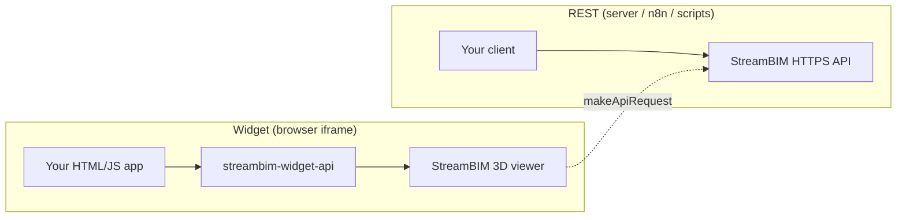

# StreamBIM API — Agent Guide

This repository is **unofficial** StreamBIM API documentation for programmatic and agentic use. Each file under `api/` is self-contained.

## What to read

| Goal | Start here |
|------|------------|
| Build a **widget** (iframe inside StreamBIM) | [api/widget-api.md](api/widget-api.md) — JavaScript viewer SDK (v3) |
| Automate **projects, topics, IFC, sync** from a backend | [README.md](README.md) → [api/authentication.md](api/authentication.md) → relevant REST section |
| **Search / export IFC** from a widget | [api/widget-api.md](api/widget-api.md) (`makeApiRequest`) + [api/ifc-searches.md](api/ifc-searches.md) |
| **BCF / collaboration** | [api/bcf.md](api/bcf.md), [api/topics.md](api/topics.md) |

## Widget vs REST API



- **Widget API**: Control the **live 3D viewer** (pick, highlight, camera, searches in-scene). Requires the **WIDGET** project feature and URL whitelisting.
- **REST API**: CRUD on projects, documents, converter jobs, topics, etc. Uses Bearer tokens from [authentication.md](api/authentication.md).

Use the widget SDK when the user must **see or interact with the model**. Use REST when running **batch jobs, integrations, or ETL** without an embedded viewer.

## Minimal widget bootstrap (v3)

```javascript
import StreamBIM from 'streambim-widget-api';

await StreamBIM.connectToParent(window, {
  pickedObject({ guid, point }) {
    console.log(guid, point);
  },
});

const projectId = await StreamBIM.API.getProjectId();
```

Embedded mode (StreamBIM in your iframe):

```javascript
const iframe = document.getElementById('streambim');
iframe.src = `https://app.streambim.com/webapp/default/#/viewer?projectId=${PROJECT_ID}&embedded=true`;

await StreamBIM.connectToChild(iframe, { pickedObject: (r) => console.log(r.guid) });
await StreamBIM.API.setNavigationMode(1);
```

**Official source:** [github.com/streambim/streambim-widget-api](https://github.com/streambim/streambim-widget-api) (master ≈ v3.0.0). Demos: `demo_embedded/`, `demo_2/`, `demo_window/`.

## Before shipping a widget

1. Contact **support@rendra.io** — whitelist widget URL + enable **WIDGET** on the project.
2. Use `StreamBIM.API.*` only **after** `connectToParent` / `connectToChild` / `connectToWindow` resolves.
3. Prefer `makeApiRequest` for REST endpoints not exposed on `StreamBIM.API` (see [ifc-searches.md](api/ifc-searches.md)).
4. List on the community marketplace when ready: [streambim-marketplace.vercel.app](https://streambim-marketplace.vercel.app/?widget=true).

## Related repos (JonatanJacobsson / orgs)

See **Widget ecosystem** in [api/widget-api.md](api/widget-api.md#widget-ecosystem--github-connections) for a full inventory of GitHub repos tied to the widget API.
